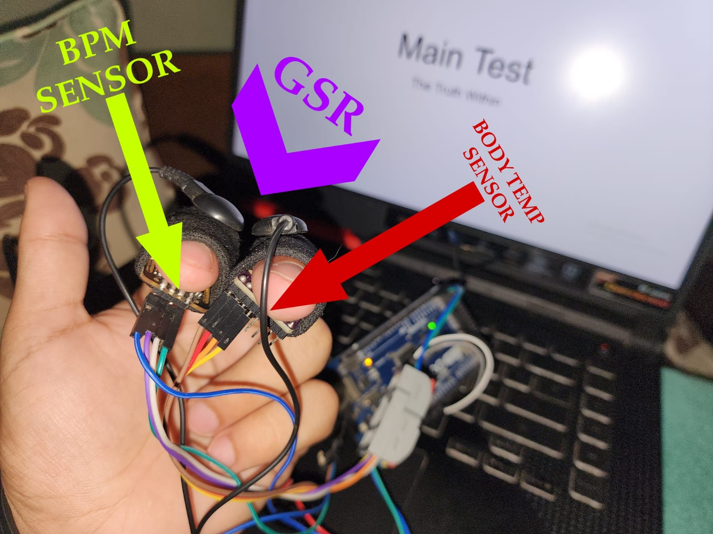
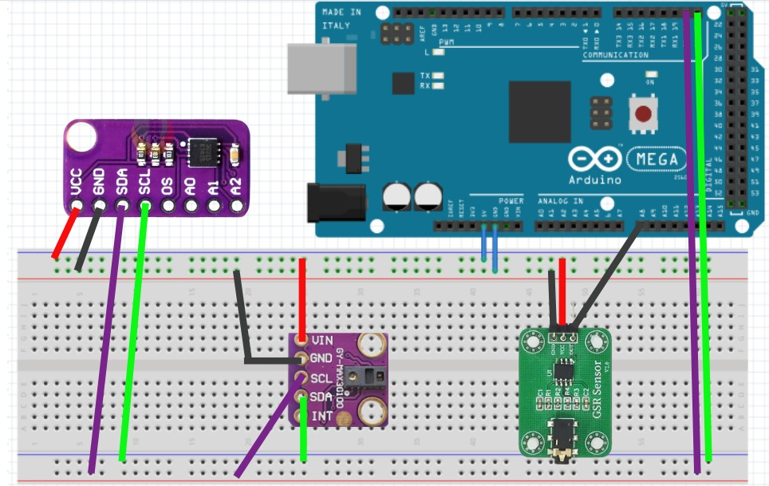

# Polygraph Data Collection System using Arduino

This project is designed to collect physiological data using an Arduino connected to multiple sensors. The data is used to train AI models for tasks such as polygraphy, lie detection, or other physiological response analysis. The system captures biometric data, including heart rate (BPM), galvanic skin response (GSR), and body temperature, and logs the data into a CSV file for machine learning purposes.

## System Overview



This image shows the Arduino setup with the connected sensors (BPM, GSR, and temperature sensors).

## Features
- **BPM Measurement**: Tracks heart rate using a BPM sensor (e.g., MAX30100/MAX30102).
- **GSR Measurement**: Monitors galvanic skin response (electrodermal activity) via an analog GSR sensor.
- **Temperature Measurement**: Measures body temperature using a temperature sensor (e.g., MLX90614).
- **Data Logging for AI Training**: Collects and logs sensor data in real-time into a CSV file, making it easy to use for training machine learning models.
- **Arduino + Python Integration**: Combines Arduino for data acquisition and Python for data logging and preparation for AI model training.

## Hardware Requirements
- **Arduino Board** (e.g., Arduino Uno or similar)
- **MAX30100/MAX30102 Sensor**: For heart rate (BPM) measurements
- **MLX90614 Temperature Sensor**: For temperature measurements
- **GSR Sensor**: For galvanic skin response measurements
- Connecting wires and breadboard

## Circuit Diagram



This diagram illustrates the connections between the Arduino, sensors, and other components.

### Wiring Details:
- **BPM Sensor (MAX30100/MAX30102)**: Connected via I2C (SCL and SDA pins)
- **Temperature Sensor (MLX90614)**: Connected via I2C (SCL and SDA pins)
- **GSR Sensor**: Connected to an analog input pin (e.g., A0)

## Software Requirements
- **Arduino IDE**: For uploading the Arduino code to the board
- **Python 3.x**: For running the data collection script
- **Arduino Libraries**:
  - Adafruit MAX30105 Library (for BPM sensor)
  - Adafruit MLX90614 Library (for temperature sensor)
- **Python Libraries**:
  - `pyserial`: To handle serial communication with the Arduino
  - `pandas`: To log and manage the sensor data

## How It Works
1. **Sensor Data Collection**: The Arduino collects biometric data from the connected sensors (BPM, GSR, and temperature) and transmits it via serial communication to a connected computer.
2. **Data Logging**: A Python script captures the incoming data and logs it into a CSV file with a timestamp. This data is then used for training AI models.
3. **AI Model Training**: The collected dataset can be fed into machine learning algorithms for tasks like polygraphy or other types of physiological data analysis.

## Use Cases
- **AI Model Training**: The system is primarily used to collect data for training AI models in physiological response analysis.
- **Research and Experiments**: Ideal for research in biometric analysis, polygraphy, and physiological data collection.
- **Lie Detection**: The combination of BPM, GSR, and temperature sensors provides a foundation for developing AI-based lie detection systems.
- **Health Monitoring**: The system can also be repurposed for basic health monitoring and AI-driven health analytics.

## Installation and Setup

### Hardware Setup
- Connect the sensors to the Arduino as per the wiring instructions in the Arduino code.
- Ensure that the BPM and temperature sensors are connected via I2C, and the GSR sensor is connected to an analog pin.

### Software Setup
1. **Upload Arduino Code**: Upload the Arduino code (`polygraph.ino`) to the Arduino board using the Arduino IDE.
2. **Install Python Dependencies**: Install the necessary Python packages by running:
   ```bash
   pip install -r Python/requirements.txt
